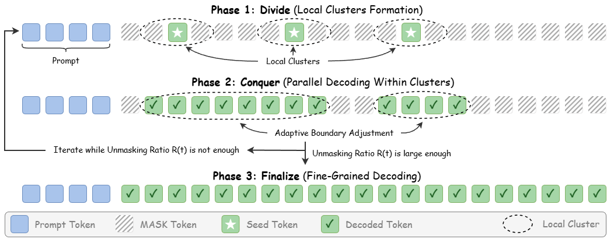
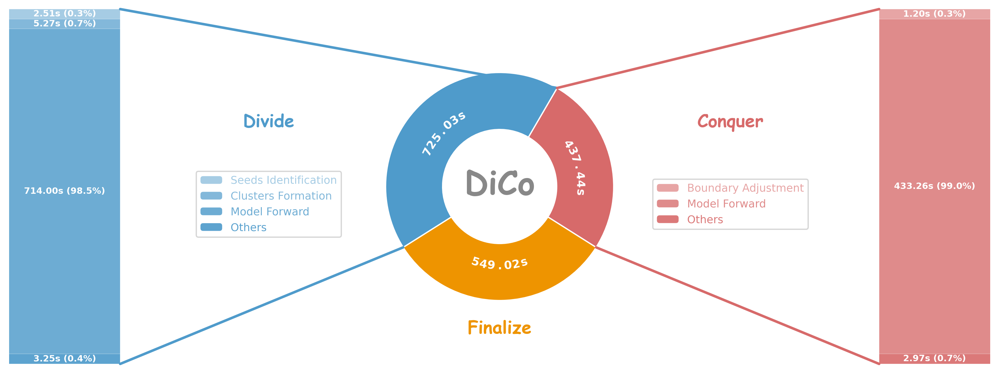

# Divide and Conquer (DiCo): Accelerating Diffusion-Based Large Language Models via Adaptive Parallel Decoding

<p align="center">
  
</p>
<p align="center">
  
</p>

## Installation

Create an environment and install the package:

```bash
conda create -n dico python=3.11
conda activate dico
pip install -e ".[eval,math]"
```

Install a CUDA-enabled PyTorch build that matches your machine if needed.

## Models

The repository does not include model weights. Download the models or point the environment variables to existing local model directories:

```bash
pip install -U "huggingface_hub[cli]"
huggingface-cli download GSAI-ML/LLaDA-8B-Instruct --local-dir models/LLaDA-8B-Instruct
huggingface-cli download Dream-org/Dream-v0-Instruct-7B --local-dir models/Dream-7B-Instruct
```

Alternatively:

```bash
export LLADA_PATH=/path/to/LLaDA-8B-Instruct
export DREAM_PATH=/path/to/Dream-v0-Instruct-7B
```

## Evaluation

Edit the variables at the top of the run script, especially `GPU_IDS`, `TASKS`, then run:

```bash
bash eval/run/run_baseline.sh
bash eval/run/run_dico.sh
bash eval/run/run_klass.sh
```

Results and logs are written to `eval/outputs/`.

HumanEval execution requires trusting generated code. The provided scripts set:

```bash
export HF_ALLOW_CODE_EVAL=1
```

## Acknowledgements

We gratefully acknowledge the open-source contributions from the LLaDA and Dream teams, as well as the lm-evaluation-harness project. Their models, code, and evaluation infrastructure provide the foundation that makes this research code possible.